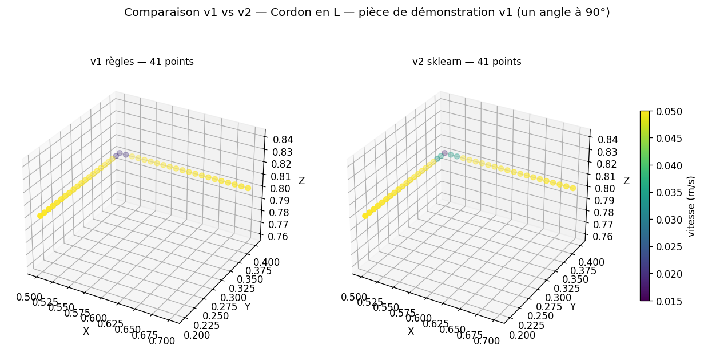

# SmartFactory — Cellule de soudage robotisée pilotée par IA

> Projet de certification · Robotique Industrielle & Simulation · niveau Avancé+
> ABB IRB 1660ID · CoppeliaSim · Python · ZMQ Remote API
> Groupe 1 — *ARCMIND ROBOTICS*

---

## Aperçu

SmartFactory simule une **cellule robotisée de soudage intelligente**. Le robot
ABB IRB 1660ID (Étant indisponible, on a utilisé ABB IRB 140) est piloté depuis Python via l'API ZMQ Remote de CoppeliaSim et
exécute des trajectoires de soudage générées par un module d'IA à partir de la
géométrie de la pièce. La qualité du cordon est surveillée en temps réel et un
rapport de fin de cycle est produit à chaque pièce.

Le système se décompose en **quatre modules** indépendants qui s'échangent un
contrat de données fixé d'avance — la *trajectoire* — ce qui permet à chaque
membre de l'équipe de travailler en parallèle.

---

## Architecture

```text
        piece.json
            │
            ▼
   ┌─────────────────────┐
   │  Module IA          │  Module 3 (Angie)        IMPLÉMENTÉ
   │  v1 règles + v2 ML  │
   └──────────┬──────────┘
              │ trajectoire = [{pos, vitesse}, ...]      ← contrat commun
              │
       ┌──────┴───────────────┐
       ▼                      ▼
   ┌────────────────────┐   ┌─────────────────────┐
   │  Intégration ZMQ   │   │  Qualité            │  Module 4 (Raphaëlla)
   │  Module 2 (Louis)  │   │  position théorique │
   │  à venir           │   │  à venir            │
   └──────────┬─────────┘   └──────────▲──────────┘
              ▼                        │
   ┌────────────────────┐              │
   │  Scène CoppeliaSim │              │ position réelle
   │  Module 1 (Delly)  │ ─────────────┘
   │  robot + pièce     │
   │  à venir           │
   └────────────────────┘
                                       │
                                       ▼
                               Rapport qualité
```

Format de la trajectoire (contrat commun, **non modifiable** sans accord d'équipe) :

```python
trajectoire = [
    {"pos": [0.500, 0.200, 0.800], "vitesse": 0.05},
    {"pos": [0.500, 0.210, 0.800], "vitesse": 0.05},
    ...
]
```

Détails complets dans [`docs/contrat_trajectoire.md`](docs/contrat_trajectoire.md).

---

## Les quatre modules

### Module 1 — Scène CoppeliaSim *(Delly Jean Jifferson)*

**Rôle** : produire la scène `.ttt` dans laquelle tout le reste tourne — robot
ABB IRB 1660ID, table, pièce à souder, torche en bout de bras, dummy IK,
*Drawing Object* pour tracer le cordon, nommage propre des objets pour que le
code Python puisse les récupérer.

**Livrable** : `scene/<nom>.ttt` + liste des noms exacts des objets exposés.
**État** : à venir.

### Module 2 — Intégration / contrôle robot *(Louis Dulze Hkloé Sassie Shaikelta)*

**Rôle** : pont Python ↔ CoppeliaSim via ZMQ, gestion du cycle complet
(HOME → approche → soudage → HOME), orchestration des appels au module IA et
au module Qualité.

**Livrable attendu** : `src/robot_control.py` (`aller_a`, `suivre_trajectoire`),
`src/main.py` (cycle complet).
**État** : structure initiale du dépôt en place ; code ZMQ à venir.

### Module 3 — IA / génération de trajectoire *(Saint-Vil Angie-Reyna Leddycia)* — **IMPLÉMENTÉ**

**Rôle** : transformer la géométrie d'une pièce en trajectoire de soudage au
format contrat commun.

Deux versions interchangeables côté consommateur (seul le profil de vitesse
change, jamais les positions) :

- **v1 — règles déterministes** ([`src/ia_trajectoire.py`](src/ia_trajectoire.py))
  - Types de joints : `"ligne"` et `"arc"` (court arc, plan quelconque)
  - Contours **fermés** (`"ferme": true`) avec analyse circulaire des angles
  - Échantillonnage régulier au `pas_mm` configurable
  - Ralentissement binaire sur 3 points autour de chaque coin > `seuil_angle_deg`

- **v2 — modèle scikit-learn** ([`src/ia_trajectoire_ml.py`](src/ia_trajectoire_ml.py))
  - `RandomForestRegressor` entraîné sur 52 pièces synthétiques (2 253 points)
  - 3 features géométriques locales (importances apprises : 11 %, 7.5 %, **81.4 %**)
  - Métriques de validation : **R² = 0.9922**, **MAE = 9×10⁻⁵ m/s**
  - Apporte deux comportements que la v1 ignore : transitions **progressives**
    autour des coins, et ralentissement sur les **arcs serrés** (rayon < 20 cm)

**Audit** : 47 tests automatisés ([`tests/audit_complet.py`](tests/audit_complet.py))
vérifient les 6 garanties du contrat, les edge cases, la cohérence v1↔v2 et la
reproductibilité stricte du pipeline ML.



### Module 4 — Qualité & visualisation *(Mibell Raphaëlla)*

**Rôle** : surveiller la qualité du soudage en temps réel — détection
d'anomalies par comparaison position réelle / position théorique, overlay
NORMAL / ANOMALIE / ARRÊT dans CoppeliaSim, tracé du cordon via le *Drawing
Object* fourni par Delly, rapport qualité de fin de cycle.

**Livrable attendu** : `src/detection_anomalies.py`
(`verifier(pos_reelle, pos_theorique, seuil)` → `"OK" | "ANOMALIE"`).
**État** : à venir.

---

## Démarrage rapide *(module IA)*

```bash
python -m pip install -r requirements.txt
```

### Générer une trajectoire

```bash
python src/ia_trajectoire.py                          # piece.json (L) — défaut
python src/ia_trajectoire.py data/piece_arc.json      # quart de cercle
python src/ia_trajectoire.py data/piece_contour.json  # contour fermé
```

### Visualiser

```bash
python src/visualiser_trajectoire.py data/piece.json        # 3D + PNG (v1)
python src/visualiser_trajectoire.py data/piece.json --ml   # 3D + PNG (v2)
python src/comparer_v1_v2.py data/piece_contour.json        # comparatif v1/v2
```

### Ré-entraîner le modèle ML

```bash
python src/entrainement_modele.py
```

Génère le dataset synthétique, entraîne le RandomForest, affiche R²/MAE et
l'importance des features, puis écrase `data/modele_vitesse.joblib`
(reproductible avec `random_state=42`).

### Lancer l'audit complet

```bash
python tests/audit_complet.py        # 47 tests, ~3 s
```

---

## Pièces de démonstration

| Pièce                                                       | Description                                  | v1 ralentit | v2 ralentit |
|-------------------------------------------------------------|----------------------------------------------|-------------|-------------|
| [`data/piece.json`](data/piece.json)                        | Cordon en L (un angle 90°)                   | 3 points    | 5 points    |
| [`data/piece_arc.json`](data/piece_arc.json)                | Quart de cercle (rayon 20 cm)                | 0           | 0           |
| [`data/piece_contour.json`](data/piece_contour.json)        | Contour rectangulaire fermé (4 × 90°)        | 12 points   | 20 points   |
| [`data/piece_mixte.json`](data/piece_mixte.json)            | Ligne + arc r=10 cm + ligne (tangent)        | 0           | **17**      |
| [`data/piece_angle_vif.json`](data/piece_angle_vif.json)    | Ligne + arc r=7.5 cm (jonction non tangente) | 3 points    | **19**      |

Captures dans [`media/`](media/) — un PNG par pièce + un comparatif v1/v2.

---

## Structure du dépôt

```text
Smart_Factory/
├── README.md
├── requirements.txt
├── data/
│   ├── piece*.json                  pièces de démonstration (5)
│   └── modele_vitesse.joblib        modèle ML entraîné (~146 Ko)
├── docs/
│   └── contrat_trajectoire.md       spec d'échange entre les 4 modules
├── media/                           figures PNG (démos + comparatifs)
├── scene/                           scènes CoppeliaSim (.ttt) — Module 1
├── src/
│   ├── ia_trajectoire.py            Module 3 — v1 règles
│   ├── ia_trajectoire_ml.py         Module 3 — v2 modèle ML
│   ├── entrainement_modele.py       Module 3 — pipeline d'entraînement
│   ├── visualiser_trajectoire.py    Module 3 — viz 3D (v1 ou v2)
│   ├── comparer_v1_v2.py            Module 3 — viz côte à côte v1/v2
│   └── (robot_control.py, main.py, detection_anomalies.py — à venir)
└── tests/
    └── audit_complet.py             47 tests automatisés (module 3)
```

---

## Documentation technique

Le **contrat d'échange** entre les modules — formats `piece.json` et
`trajectoire`, API publique des deux versions de l'IA, détails du modèle ML,
points ouverts à valider en équipe — est documenté dans
**[`docs/contrat_trajectoire.md`](docs/contrat_trajectoire.md)**.

C'est la référence partagée par les quatre modules : tout consommateur de la
trajectoire (Louis pour `suivre_trajectoire`, Raphaëlla pour `verifier`) doit
s'y conformer.

---

## Équipe — Groupe 1 *(ARCMIND ROBOTICS)*

| Membre                                | Module                            |
|---------------------------------------|--------                           |
| Delly Jean Jifferson                  | 1 — Scène CoppeliaSim             |
| Louis Dulze Hkloé Sassie Shaikelta    | 2 — Intégration / contrôle robot  |
| Saint-Vil Angie-Reyna Leddycia        | 3 — IA / trajectoire              |
| Mibell Raphaëlla                      | 4 — Qualité & visualisation       |

Coordination partagée — pas de chef unique. Livrables transverses partagés par
les 4 membres : README, vidéo de démo, oral de 10 min.

Formateur : Carlos Yfrazin · *Hart's (EIC)*
